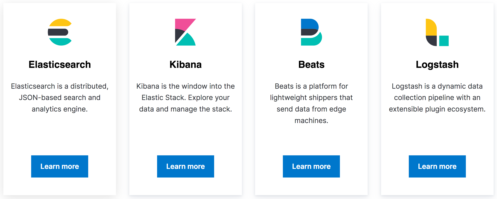
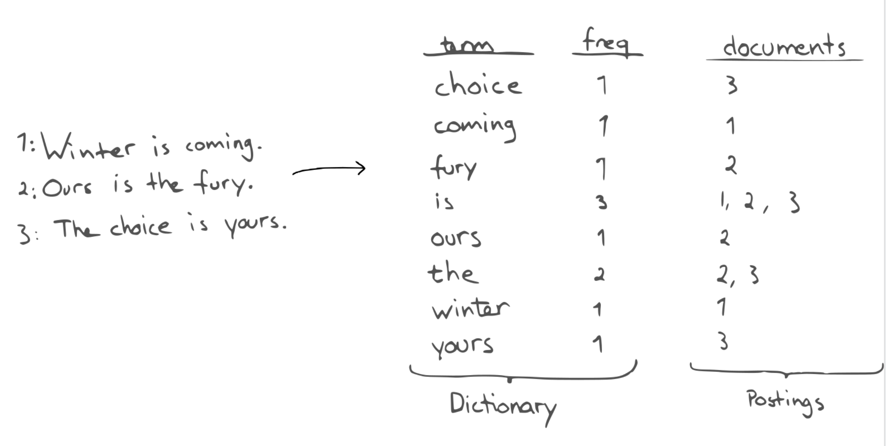

theme: Ostrich
footer: 
autoscale: true

### Now where did I leave my keys?

# 

### @emanuil_tolev

^ Community engineer at Elastic.
^ Ran a cluster, small co, on call, etc.

---

## What is the Elastic Stack?

---

^ Large open source projects: Elasticsearch, Kibana, Beats and Logstash
^ At the heart is Elasticsearch, an open source search and data analytics engine.
^ Kibana is an open source visualisations and dashboarding tool
^ The rest support logging, metrics and tracing, a use case with 1000s of big company and millions of smaller users.

---

^ Search. We often think of it as a needle in a haystack. Let's have a look at some dictionary definitions.

---

# Search

GENERAL: "try to find something by looking or otherwise seeking carefully and thoroughly."

COMPUTING: "the systematic retrieval of information, or the facility for this."

^ 2 examples: DOAJ and nuclear reactor database

---

# Visualisation

^ We'll see many examples in a minute. But those are the two main principles underlying the technology: search (aka information retrieval) and summarising the information in visualisations. Everything is built on those two principles and they are the two core human cognitive processes that our tech enhances.

---

## Elasticsearch scales horizontally - you can add more pieces

^ ES is famous for this.
^ & thus memory/CPU/etc. Its strength is the easy addition and coordination with new nodes. Your computations can scale as much RAM as a whole cluster, but the interface and commands you use remain as if it were just one node on your laptop.

---

#  Use in production

- Search (online shop front, admin tooling, recommendation systems, ...)
- Web app monitoring: "Logging, Metrics, Traces"
- Now security too

---

# Use in production

- Interactive dashboarding
- Unsupervised learning (though this is paid)
- Analytics (business metrics)

---

^ under the hood Apache Lucene
^ Elasticsearch is the glue

---

<!--
---

## Simple demo of scale - experimental interface

^ we are working on more tooling I cannot yet show you. One is a library that makes certain analytical abstractions available via Elasticsearch, like the average of a column of data for ex. The calculations are available over much larger datasets than possible using pure Python.
-->
---

## Demo time!

^ So far you've seen some in depth open source but this would be about as commercially successful and sustainable as Linux on the Desktop has been so far, without some eye catching stuff.

^ Quick flash of what is possible.

<!--
If it's around, the setup from the workshop on intro to data science - same as David Pilator's Introduction to Elasticsearch data - show a few basic things in the Kibana console and then show exploring David's generated person data, making a vis of it. http://localhost:5601/app/kibana#/dev_tools/console?_g=()

-->

---

### Maybe it can't help you find your keys, but along the way, Elasticsearch has helped people do:

- [Interplanetary research with JPL](https://www.elastic.co/elasticon/2015/sf/unlocking-interplanetary-datasets-with-real-time-search)
- [JPL Curiosity Mars Rover and more](https://www.elastic.co/elasticon/conf/2018/sf/concept-to-flight-engineering-software-for-systems-engineers-at-jpl)
- [The search for food at Just Eat](https://www.elastic.co/customers/just-eat)
- [Nuclear energy computing at Fermi Labs](https://www.elastic.co/elasticon/conf/2018/sf/reinventing-fermilabs-scientific-computing-grid-accounting-with-the-elastic-stack)
- [Primary search at eBay](https://www.elastic.co/videos/ebay-and-elasticsearch-this-is-not-small-data)
- [Playing with tech at Engadget](https://www.elastic.co/customers/engadget)
- [Tech DIY search at Instructables](https://www.elastic.co/customers/instructables)

^ Elasticsearch has powered all kinds of search. From the analytics of the Mars rover, to allowing you to do your last minute Christmas shopping at John Lewis, Marks & Spencers & eBay, through finding an Uber on Christmas day when transport is out, to finding love on Tinder (or at least companionship).
^ The power of that technology is also in your hands, Elasticsearch being open source.
^ Links in this slide - will be posted in meetup group.

---

# Useful Linux uses and other resources

- [Monitoring Linux Command Execution with Auditbeat and Elastic Stack](https://discuss.elastic.co/t/dec-2nd-2019-en-auditbeat-monitoring-linux-command-execution/209125)
- [Christmas tree lights with Micro:bit](https://discuss.elastic.co/t/dec-17th-2019-en-iot-christmas-tree-lights-with-elasticsearch-and-micro-bit/211659)
- ["Awesome List" for Elasticsearch](https://github.com/dzharii/awesome-elasticsearch)

---

## Thank you!

@emanuil_tolev
etolev@elastic.co

<!--

Interactive dashboarding demo URL:
https://demo.elastic.co/app/kibana#/dashboard/7adfa750-4c81-11e8-b3d7-01146121b73d?_g=(refreshInterval:(pause:!f,value:900000),time:(from:now-24h,to:now))&_a=(description:'Analyze%20mock%20flight%20data%20for%20ES-Air,%20Logstash%20Airways,%20Kibana%20Airlines%20and%20JetBeats',filters:!(),fullScreenMode:!f,options:(hidePanelTitles:!f,useMargins:!t),panels:!((embeddableConfig:(),gridData:(h:7,i:'1',w:32,x:0,y:0),id:aeb212e0-4c84-11e8-b3d7-01146121b73d,panelIndex:'1',type:visualization,version:'6.3.0'),(embeddableConfig:(vis:(colors:('Average%20Ticket%20Price':%230A50A1,'Flight%20Count':%2382B5D8),legendOpen:!f)),gridData:(h:12,i:'3',w:23,x:17,y:7),id:c8fc3d30-4c87-11e8-b3d7-01146121b73d,panelIndex:'3',type:visualization,version:'6.3.0'),(embeddableConfig:(),gridData:(h:15,i:'4',w:48,x:0,y:85),id:'571aaf70-4c88-11e8-b3d7-01146121b73d',panelIndex:'4',type:search,version:'6.3.0'),(embeddableConfig:(vis:(colors:(ES-Air:%23447EBC,JetBeats:%2365C5DB,'Kibana%20Airlines':%23BA43A9,'Logstash%20Airways':%23E5AC0E),legendOpen:!f)),gridData:(h:12,i:'5',w:17,x:0,y:7),id:'8f4d0c00-4c86-11e8-b3d7-01146121b73d',panelIndex:'5',type:visualization,version:'6.3.0'),(embeddableConfig:(vis:(colors:('Carrier%20Delay':%235195CE,'Late%20Aircraft%20Delay':%231F78C1,'NAS%20Delay':%2370DBED,'No%20Delay':%23BADFF4,'Security%20Delay':%23052B51,'Weather%20Delay':%236ED0E0))),gridData:(h:14,i:'6',w:24,x:24,y:33),id:f8290060-4c88-11e8-b3d7-01146121b73d,panelIndex:'6',type:visualization,version:'6.3.0'),(embeddableConfig:(),gridData:(h:14,i:'7',w:24,x:24,y:19),id:bcb63b50-4c89-11e8-b3d7-01146121b73d,panelIndex:'7',type:visualization,version:'6.3.0'),(embeddableConfig:(vis:(colors:(Count:%231F78C1),legendOpen:!f)),gridData:(h:12,i:'10',w:24,x:0,y:35),id:'9886b410-4c8b-11e8-b3d7-01146121b73d',panelIndex:'10',type:visualization,version:'6.3.0'),(embeddableConfig:(vis:(colors:(Count:%231F78C1),legendOpen:!f)),gridData:(h:8,i:'13',w:14,x:10,y:19),id:'76e3c090-4c8c-11e8-b3d7-01146121b73d',panelIndex:'13',type:visualization,version:'6.3.0'),(embeddableConfig:(vis:(colors:(Count:%231F78C1),legendOpen:!f)),gridData:(h:8,i:'14',w:14,x:10,y:27),id:'707665a0-4c8c-11e8-b3d7-01146121b73d',panelIndex:'14',type:visualization,version:'6.3.0'),(embeddableConfig:(mapCenter:!(27.421687059550266,15.371002131141724),mapZoom:1),gridData:(h:15,i:'18',w:24,x:24,y:70),id:'79e8ff60-4c8e-11e8-b3d7-01146121b73d',panelIndex:'18',type:visualization,version:'6.3.0'),(embeddableConfig:(),gridData:(h:8,i:'21',w:48,x:0,y:62),id:'293b5a30-4c8f-11e8-b3d7-01146121b73d',panelIndex:'21',type:visualization,version:'6.3.0'),(embeddableConfig:(),gridData:(h:7,i:'22',w:16,x:32,y:0),id:'129be430-4c93-11e8-b3d7-01146121b73d',panelIndex:'22',type:visualization,version:'6.3.0'),(embeddableConfig:(mapCenter:!(42.19556096274418,9.536742995308601e-7),mapZoom:1),gridData:(h:15,i:'23',w:24,x:0,y:70),id:'334084f0-52fd-11e8-a160-89cc2ad9e8e2',panelIndex:'23',type:visualization,version:'6.3.0'),(embeddableConfig:(vis:(defaultColors:('0%20-%2050':'rgb(247,251,255)','100%20-%20150':'rgb(107,174,214)','150%20-%20200':'rgb(33,113,181)','200%20-%20250':'rgb(8,48,107)','50%20-%20100':'rgb(198,219,239)'),legendOpen:!f)),gridData:(h:8,i:'25',w:10,x:0,y:19),id:f8283bf0-52fd-11e8-a160-89cc2ad9e8e2,panelIndex:'25',type:visualization,version:'6.3.0'),(embeddableConfig:(vis:(defaultColors:('0%20-%2050':'rgb(247,251,255)','100%20-%20150':'rgb(107,174,214)','150%20-%20200':'rgb(33,113,181)','200%20-%20250':'rgb(8,48,107)','50%20-%20100':'rgb(198,219,239)'),legendOpen:!f)),gridData:(h:8,i:'27',w:10,x:0,y:27),id:'08884800-52fe-11e8-a160-89cc2ad9e8e2',panelIndex:'27',type:visualization,version:'6.3.0'),(embeddableConfig:(vis:(defaultColors:('0%20-%2011':'rgb(247,251,255)','11%20-%2022':'rgb(208,225,242)','22%20-%2033':'rgb(148,196,223)','33%20-%2044':'rgb(74,152,201)','44%20-%2055':'rgb(23,100,171)'),legendOpen:!f)),gridData:(h:15,i:'28',w:24,x:0,y:47),id:e6944e50-52fe-11e8-a160-89cc2ad9e8e2,panelIndex:'28',type:visualization,version:'6.3.0'),(embeddableConfig:(),gridData:(h:6,i:'29',w:8,x:40,y:7),id:'01c413e0-5395-11e8-99bf-1ba7b1bdaa61',panelIndex:'29',type:visualization,version:'6.3.0'),(embeddableConfig:(),gridData:(h:6,i:'30',w:8,x:40,y:13),id:'2edf78b0-5395-11e8-99bf-1ba7b1bdaa61',panelIndex:'30',type:visualization,version:'6.3.0'),(embeddableConfig:(),gridData:(h:15,i:'31',w:24,x:24,y:47),id:ed78a660-53a0-11e8-acbd-0be0ad9d822b,panelIndex:'31',type:visualization,version:'6.3.0')),query:(language:kuery,query:''),timeRestore:!t,title:'%5BFlights%5D%20Global%20Flight%20Dashboard',viewMode:view)

Earthquakes: https://earthquakes.eden.elstc.co/app/kibana#/dashboard/Earthquake?_g=(filters:!(),refreshInterval:(pause:!t,value:0),time:(from:now-10y%2Fy,to:now))&_a=(description:'',filters:!(),fullScreenMode:!f,options:(darkTheme:!f),panels:!((embeddableConfig:(),gridData:(h:8,i:'2',w:48,x:0,y:40),id:Earthquake-Depth-Timeseries,panelIndex:'2',type:visualization,version:'7.3.0'),(embeddableConfig:(),gridData:(h:24,i:'3',w:36,x:12,y:0),id:Earthquake-Heatmap,panelIndex:'3',type:visualization,version:'7.3.0'),(embeddableConfig:(),gridData:(h:24,i:'4',w:12,x:0,y:0),id:Earthquake-Title,panelIndex:'4',type:visualization,version:'7.3.0'),(embeddableConfig:(),gridData:(h:8,i:'5',w:24,x:0,y:24),id:Earthquake-Count,panelIndex:'5',type:visualization,version:'7.3.0'),(embeddableConfig:(),gridData:(h:8,i:'6',w:48,x:0,y:32),id:Earthquake-Count-per-Magnitude-Stacked,panelIndex:'6',type:visualization,version:'7.3.0'),(embeddableConfig:(),gridData:(h:8,i:'7',w:12,x:36,y:24),id:Earthquake-Types-and-Data-Sources,panelIndex:'7',type:visualization,version:'7.3.0'),(embeddableConfig:(),gridData:(h:8,i:'8',w:12,x:24,y:24),id:Earthquake-Magnitude-Histogram,panelIndex:'8',type:visualization,version:'7.3.0')),query:(language:lucene,query:''),timeRestore:!t,title:Earthquake,viewMode:view)

Unsupervised Learning: https://ml.eden.elstc.co/app/ml#/jobs?_g=(refreshInterval:(pause:!t,value:0),time:(from:now-15m,to:now))
-->
